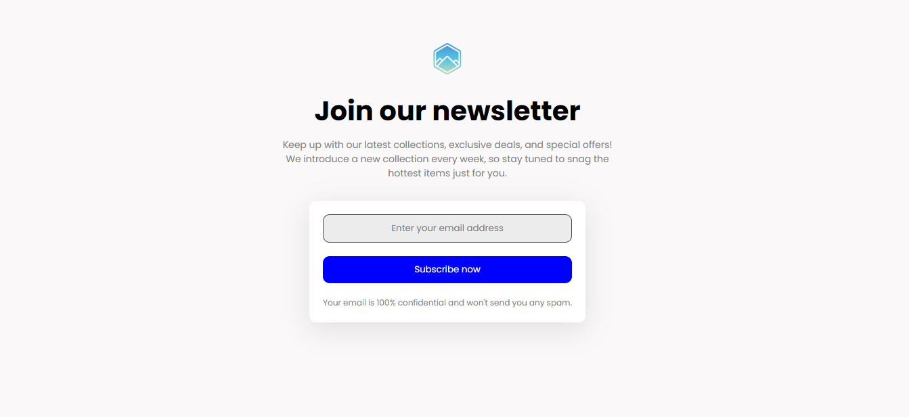

# Join Our Newsletter

A simple and clean newsletter signup page built with HTML and CSS.  
This project is a practice challenge to replicate a newsletter subscription UI, focusing on layout, styling, and basic interactivity.

---

## Features

- Responsive, centered layout using Flexbox
- Clean input field with placeholder styling
- Stylish subscribe button with hover effects
- Accessible and semantic HTML structure
- Custom font from Google Fonts (Poppins)
- Favicon and logo included for branding

---

## Preview

Author: Rakimzreal  🚀 🚀